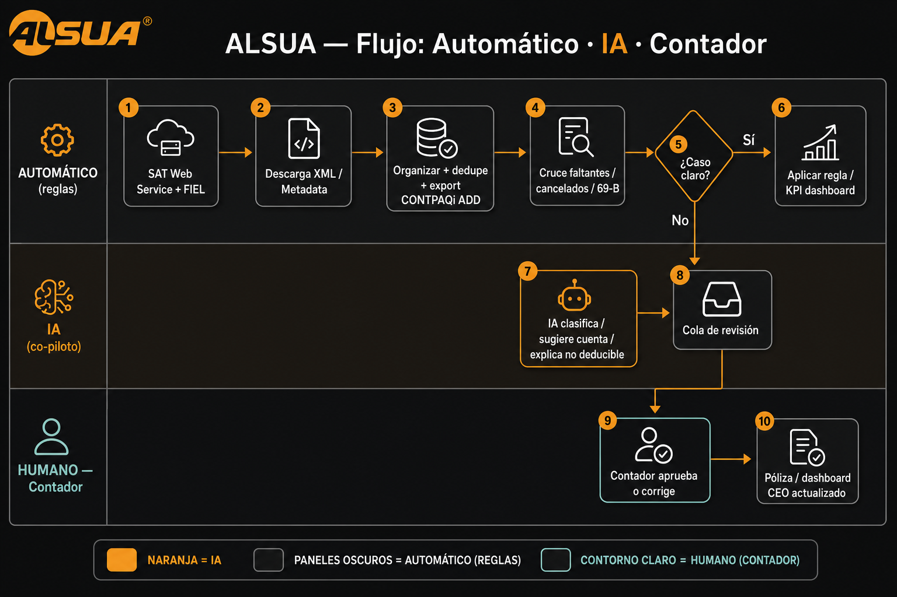

# Flujo: automático · IA · contador

Diagrama de intervención humana e IA en ALSUA.

## Roles

| Rol | Qué hace |
|-----|----------|
| **Automático (reglas)** | Descarga SAT, organizar, export ADD, cruces duros (faltantes, cancelados, 69-B), KPIs claros |
| **IA (co-piloto)** | Clasifica casos dudosos, sugiere cuenta, explica no deducible, resume para CEO |
| **Humano (contador)** | Aprueba, corrige y cierra póliza / criterio fiscal |

## Principio

- Lo claro → automático  
- Lo dudoso → IA sugiere  
- Lo fiscal/contable final → **siempre contador**
